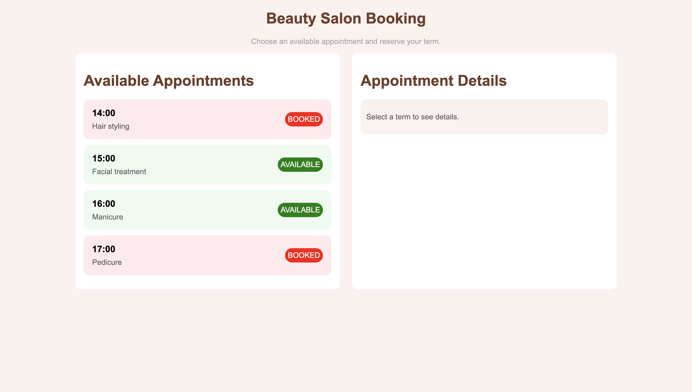

# Booking Application

This is a simple appointment booking application built with Angular. The application allows users to view available appointments, book them, and view their details.

## Screenshot



## Features

- View available and booked appointments
- Reserve the appointment
- View appointment details

## Tech Stack

- Angular
- JavaScript
- HTML
- CSS

## Installation

1. Clone the repository and install the dependencies:

```bash
git clone https://github.com/PerosevicAleksandar/angular-booking-app.git
cd angular-booking-app
npm install
```

2. Development server

To start a local development server, run:

```bash
ng serve
```

Once the server is running, open your browser and navigate to `http://localhost:4200/`. The application will automatically reload whenever you modify any of the source files.
